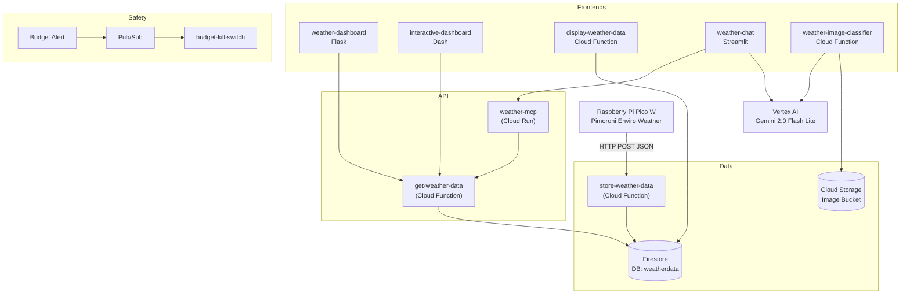
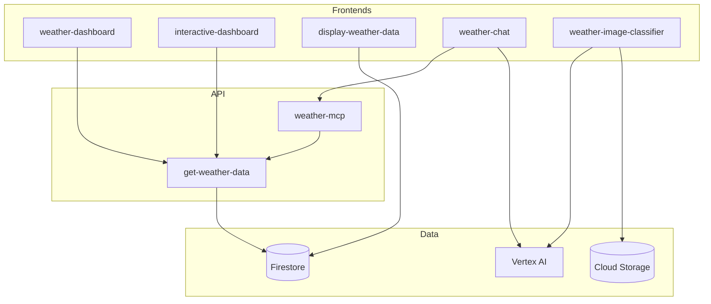

# WeatherCloud Architecture

> Personal weather station project running on Google Cloud Platform.
> **GCP Project:** `weathercloud-460719` | **Region:** `europe-west2` (London)
> **Budget:** £5/month (enforced by kill-switch)

---

## System Overview

WeatherCloud ingests weather data from a Pimoroni Enviro Weather device (Raspberry Pi Pico W), stores it in Firestore, and presents it through multiple web interfaces including dashboards, an interactive analytics tool, a Gemini-powered chatbot, and an image classifier.



---

## Data Flow

### 1. Data Ingestion (Pico to Firestore)

The Enviro Weather device POSTs JSON readings every ~15 minutes to the `store-weather-data` endpoint.

**Inbound payload:**

```json
{
    "temperature": 22.5,
    "humidity": 65.2,
    "pressure": 1013.25,
    "rain": 0.0,
    "rain_rate": 0.0,
    "luminance": 5000,
    "wind_speed": 5.2,
    "wind_direction": 180.0,
    "timestamp": "2025-06-05T14:20:33Z"
}
```

**Processing by `store-weather-data`:**

1. Parses UTC timestamp, converts to London local time for document ID
2. Adjusts pressure to **Mean Sea Level Pressure (MSLP)** using altitude (120m) and the barometric formula
3. Filters spurious wind speed readings (>200 mph replaced with 0)
4. Stores `absolute_pressure` (raw) alongside corrected `pressure` (MSLP)
5. Stores as `timestamp_UTC` (native Firestore timestamp)
6. Document ID format: `reading_YYYY-MM-DDTHH-MM-SS` (local time)

**Firestore structure:**

- Database: `weatherdata`
- Collection: `weather-readings`
- Document fields: `temperature`, `humidity`, `pressure`, `absolute_pressure`, `rain`, `rain_rate`, `luminance`, `wind_speed`, `wind_direction`, `signal_strength`, `timestamp_UTC`

### 2. Data Retrieval (get-weather-data)

A flexible query API that all frontends call. Accepts POST requests with JSON.

**Query modes:**

| Mode             | Example                                  | Description                                                                                                          |
| ---------------- | ---------------------------------------- | -------------------------------------------------------------------------------------------------------------------- |
| Keyword range    | `{"range": "today"}`                     | Predefined: `latest`, `first`, `all`, `today`, `yesterday`, `last24h`, `last7days`, `week`, `month`, `year`          |
| Parameterised    | `{"range": "month=6"}`                   | Specific: `day=N`, `week=N`, `month=N`, `year=YYYY`                                                                 |
| Explicit window  | `{"start": "...", "end": "..."}`         | ISO-8601 UTC timestamps                                                                                             |
| Field selection  | `{"fields": ["temperature", "rain"]}`    | Optional - reduces payload and query cost                                                                            |

Returns JSON array of documents, ordered by `timestamp_UTC` ascending.

### 3. MCP Server (weather-mcp)

An intermediary between the chatbot and `get-weather-data`. Adds:

- Server-side **aggregation** (max, min, mean, sum, count)
- Unit metadata
- ISO-8601 interval parsing

The chatbot calls `weather-mcp` via HTTP POST, which in turn calls `get-weather-data`.

---

## Services

### Frontend Services

| Service                      | Framework                           | Deployment              | URL                                          |
| ---------------------------- | ----------------------------------- | ----------------------- | -------------------------------------------- |
| **weather-dashboard**        | Flask + Matplotlib + calplot        | Cloud Run (Dockerfile)  | `weather-dashboard-...-nw.a.run.app`         |
| **interactive-dashboard**    | Plotly Dash + Bootstrap             | Cloud Run (source)      | `interactive-dashboard-...-nw.a.run.app`     |
| **display-weather-data**     | Pure HTML (server-rendered)         | Cloud Function (Gen2)   | `display-weather-data-...-nw.a.run.app`      |
| **weather-chat**             | Streamlit + Vertex AI               | Cloud Run (Dockerfile)  | `weather-chat-...-nw.a.run.app`              |
| **weather-image-classifier** | Pure HTML + Vertex AI + GCS         | Cloud Function (Gen2)   | `...europe-west1.../weather-image-classifier` |

### Backend Services

| Service                  | Purpose                                  | Deployment              |
| ------------------------ | ---------------------------------------- | ----------------------- |
| **store-weather-data**   | HTTP endpoint for Pico to POST readings  | Cloud Function (Gen2)   |
| **get-weather-data**     | Query API for all frontends              | Cloud Function (Gen2)   |
| **weather-mcp**          | Aggregation layer for chatbot            | Cloud Run (Dockerfile)  |

### Safety Services

| Service                  | Purpose                                  | Trigger                          |
| ------------------------ | ---------------------------------------- | -------------------------------- |
| **budget-kill-switch**   | Detaches billing when spend hits budget  | Pub/Sub (budget alert at £5)     |

---

## Service Dependencies



> [!IMPORTANT]
> `display-weather-data` queries Firestore **directly** (not via `get-weather-data`). All other frontends go through the API layer.

---

## GCP Resource Inventory

### Compute (all scale-to-zero)

| Service                    | Type             | CPU   | Memory | Max Instances | Region           |
| -------------------------- | ---------------- | ----- | ------ | ------------- | ---------------- |
| `store-weather-data`       | Cloud Function   | 0.17  | 256M   | 100           | europe-west2     |
| `get-weather-data`         | Cloud Function   | 1     | 1Gi    | 100           | europe-west2     |
| `display-weather-data`     | Cloud Function   | 0.17  | 256M   | 100           | europe-west2     |
| `budget-kill-switch`       | Cloud Function   | 0.17  | 256M   | 100           | europe-west2     |
| `weather-image-classifier` | Cloud Function   | 0.58  | 1Gi    | 34            | **europe-west1** |
| `interactive-dashboard`    | Cloud Run        | 1     | 1Gi    | 20            | europe-west2     |
| `weather-chat`             | Cloud Run        | 1     | 512Mi  | 40            | europe-west2     |
| `weather-dashboard`        | Cloud Run        | 1     | 512Mi  | 40            | europe-west2     |
| `weather-mcp`              | Cloud Run        | 1     | 512Mi  | 40            | europe-west2     |

> All services have **min instances = 0** — no cost when idle.

### Storage

| Resource                     | Type                          | Location          |
| ---------------------------- | ----------------------------- | ----------------- |
| Firestore (`weatherdata`)    | Firestore Native              | europe-west2      |
| Container images             | gcr.io + Artifact Registry    | us / europe-west2 |
| Image classifier bucket      | Cloud Storage                 | (set via env var) |

### Other Resources

| Resource                         | Purpose                                    |
| -------------------------------- | ------------------------------------------ |
| Pub/Sub topic `budget-alerts`    | Receives billing budget notifications      |
| Pub/Sub subscription             | Pushes alerts to `budget-kill-switch`      |
| Billing Budget (£5/month)        | Triggers kill-switch at 100% spend         |

---

## AI / Gemini Integration

### Weather Chatbot (weather-chat)

- **Model:** `gemini-2.0-flash-lite-001` via Vertex AI
- **Location:** `us-central1` (model availability)
- **Pattern:** Function calling — Gemini calls `query_weather` tool, which POSTs to `weather-mcp`
- **Framework:** Streamlit with custom CSS to match the shared navbar
- **Conversation limit:** 4 turns before context is trimmed

### Image Classifier (weather-image-classifier)

- **Model:** `gemini-2.0-flash-lite-001` via Vertex AI
- **Location:** `europe-west1` (set via env var)
- **Pattern:** Direct image classification — user uploads photo, Gemini classifies weather condition
- **Classifications:** `sunny`, `partly_cloudy`, `overcast`, `raining`, `snowing`, `foggy`, `night`, `dawn`, `dusk`
- **Storage:** Results + image stored in Cloud Storage bucket, pointer file tracks latest

---

## Shared Navigation

All frontend services share a consistent **black hamburger menu navbar** with links to:

1. **Summary** — `weather-dashboard`
2. **Dashboard** — `interactive-dashboard`
3. **Chatbot** — `weather-chat`
4. **Data** — `display-weather-data`
5. **Image Classifier** — `weather-image-classifier`

The navbar CSS is duplicated across services (no shared component library). Each service implements it independently.

---

## Deployment

### Cloud Functions (deployed via gcloud functions deploy)

```bash
# Example: store-weather-data
gcloud functions deploy store-weather-data \
  --runtime python311 \
  --trigger-http \
  --allow-unauthenticated \
  --entry-point store_weather_data \
  --memory 256MB \
  --timeout 60s \
  --region europe-west2

# Example: display-weather-data (Gen2)
gcloud functions deploy display-weather-data \
  --gen2 \
  --runtime python311 \
  --entry-point app \
  --source . \
  --region europe-west2 \
  --trigger-http \
  --allow-unauthenticated \
  --memory 512MB
```

### Cloud Run services (deployed via gcloud builds submit + gcloud run deploy)

```bash
# Build and push image
gcloud builds submit --tag gcr.io/weathercloud-460719/weather-chat

# Deploy
gcloud run deploy weather-chat \
  --image gcr.io/weathercloud-460719/weather-chat \
  --region=europe-west2 \
  --allow-unauthenticated
```

### Useful Commands

```bash
# View logs
gcloud run services logs read weather-chat --region=europe-west2 --limit=50

# Tail logs
gcloud beta run services logs tail store-weather-data \
  --project weathercloud-460719 --region europe-west2

# List all services
gcloud run services list --project=weathercloud-460719
```

---

## Cost Management

### Budget Protection

- **Budget:** £5/month on project `weathercloud-460719`
- **Kill Switch:** When spend reaches 100% of budget, `budget-kill-switch` automatically detaches the billing account, shutting everything down
- **Re-enable:** See `kill-switch/reenable_account_command.txt`

### Cost Drivers (ordered by impact)

1. **Container image storage** — Artifact Registry / gcr.io charges ~$0.10/GB/month. Old images accumulate with each deploy.
2. **Firestore reads** — Free tier is generous (50K reads/day) but `weather-dashboard` makes multiple queries per page load
3. **Cloud Run invocations** — All scale-to-zero, so cost is purely usage-based
4. **Vertex AI** — Per-token pricing for Gemini calls (chatbot + image classifier)

### Cleanup Policies

Automatic cleanup policies are configured on all Artifact Registry repos (as of May 2026):

- Delete untagged images older than 7 days
- Always keep at least 3 most recent versions

Policy file: `cleanup-policy.json`

---

## Repository Structure

```
weathercloud/
├── store-weather-data/       # Data ingestion (Pico → Firestore)
│   ├── main.py               # Cloud Function entry point
│   ├── weather_backfill.py   # Utility for backfilling data
│   └── requirements.txt
├── get-weather-data/         # Query API
│   ├── main.py               # Cloud Function with rich query language
│   └── requirements.txt
├── display-weather-data/     # Raw data table view
│   ├── main.py               # Server-rendered HTML with pagination
│   └── requirements.txt
├── weather-dashboard/        # Summary dashboard
│   ├── main.py               # Flask app with Matplotlib charts
│   ├── templates/            # Jinja2 templates
│   ├── static/               # CSS/JS
│   ├── Dockerfile
│   └── requirements.txt
├── interactive_dashboard/    # Plotly Dash analytics
│   ├── main.py               # Dash app with interactive charts
│   ├── Procfile
│   └── requirements.txt
├── weather-chat/             # Gemini chatbot
│   ├── app.py                # Streamlit app with Vertex AI function calling
│   ├── Dockerfile
│   └── requirements.txt
├── weather-image-classifier/ # AI image classification
│   ├── main.py               # Cloud Function + Gemini vision
│   ├── deploy.sh
│   └── requirements.txt
├── weather-mcp/              # (not in repo — deployed separately?)
├── kill-switch/              # Budget protection
│   ├── main.py               # Detaches billing on budget alert
│   └── requirements.txt
├── notes/                    # Deploy commands and reference
├── screenshots/              # README images
├── cleanup-policy.json       # Artifact Registry auto-cleanup
└── readme.md
```

---

## Key Design Decisions

1. **Microservices over monolith** — Each concern is a separate Cloud Function/Run service. This allows independent scaling and deployment, but means shared concerns (navbar CSS, wind direction conversion) are duplicated.

2. **UTC storage, local display** — All timestamps stored as UTC in Firestore. Conversion to Europe/London happens at query/display time. Document IDs use local time for human readability.

3. **MSLP correction** — Raw pressure is corrected to Mean Sea Level using the barometric formula at 120m altitude. Both `absolute_pressure` and corrected `pressure` are stored.

4. **Gemini function calling** — The chatbot doesn't query Firestore directly. It uses Vertex AI function calling to invoke `query_weather`, which hits `weather-mcp` then `get-weather-data` then Firestore. This keeps the AI layer decoupled from the data layer.

5. **All services allow unauthenticated access** — Simplicity over security for a personal project. Budget kill-switch provides the safety net.

6. **weather-image-classifier in europe-west1** — Different region from everything else, chosen for Gemini model availability at the time of deployment.
